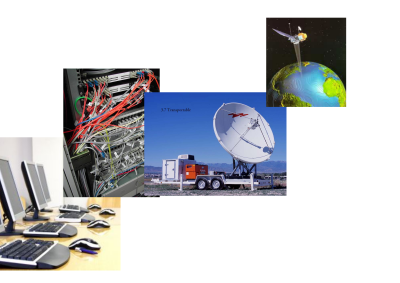

# Introduction

The aim of this module is to promote graduate-level study of topics in computer
network implementation. As a student, you will apply modern principles,
software, techniques and tools to the investigation, analysis and evaluation of
computer network implementations. You will also become familiar with topics at
the forefront of current networking research. 

One of the features of the module is that you are encouraged to work directly
with primary sources, including ISO standards, RFC's and original research
papers. 

Lectures are the main vehicle for introducing fundamental concepts and
principles and for providing context and motivation. Students will be
expected to prepare for lecture topics and deepen their understanding
of course material by studying course texts and technical
literature. Seminars and laboratory sessions support the lecture
programme by providing students with opportunities to identify and
apply appropriate techniques for the application and implementation of
a variety of OS services.

Formative assessment will be provided in the form of small weekly exercises,
mainly practical in nature. Summative assessment is by way of a single piece of
coursework comprising a group project and an individual technical/research
report.

# Module Team

|   |    |
|---|:---|
|Module Tutor &nbsp;  | [David Kendall](http://computing.northumbria.ac.uk/staff/cgdk2)|

# Teaching Arrangements

|   |    |
|---|:---|
Lecture/Lab &nbsp;| Wed 11.00 - 15.00 PB B1

There is one 4-hour session per week that will be used primarily for lab work
but with some lecture material to provide context and motivation and to
introduce techniques and tools. This session will also provide an opportunity
to discuss the readings.

# Synopsis

The aim of this module is to provide an opportunity to study modern computer
network implementation at graduate level.

On completion of this module, students will be able to:

1. Understand, apply and critically discuss principles in managing the
   complexity of computer networks, in particular layered, service-oriented and
   protocol-oriented views of network architecture.

1. Discuss the design principles and implementation of a variety of key
   networking protocols and algorithms and critically evaluate their
   effectiveness in practice.

1. Apply appropriate theory, practice and tools to the implementation of
   computer networks.

1. Discuss applications, protocols, algorithms and tools of current interest to
   the computer network research community.

# Teaching Plan

The following is a *provisional* guide to the organisation of
this part of the module for this year. These arrangements are subject to
change during the course of the module.

| Week   | W/c   | Lecture   | Practical   | Reading   |
| :----: | :---: | :-------: | :---------: | :-------: |
**1** | 15-Jan &nbsp; | [Introduction to the module]({{site.raurl}}/A01.pdf) &nbsp; | [Introduction to Virtualbox and Ubuntu desktop](L01.html) | [How to read a paper]({{site.raurl}}/kes12.pdf)   [A brief history of the Internet](https://www.internetsociety.org/internet/history-internet/brief-history-internet/)
**2** | 22-Jan &nbsp; | [Virtualisation]({{site.raurl}}/A02.pdf) | [Headless Ubuntu server](L02.html) | [A comparison of software and hardware techniques for x86 virtualization]({{site.raurl}}/aa06.pdf)   [Xen and the art of virtualization]({{site.raurl}}/bdf03.pdf)
**3** | 29-Jan &nbsp; | [IP Architecture]({{site.raurl}}/A03.pdf) | [TCP performance measurement](L03.html) | [A protocol for packet network intercommunication]({{site.raurl}}/ck74.pdf)   [The design philosophy of the DARPA Internet protocols]({{site.raurl}}/cla88.pdf)   [End to end arguments in system design]({{site.raurl}}/src84.pdf)
**4** | 05-Feb &nbsp; | [Case study: DNS and Bind]({{site.raurl}}/A04.pdf) | [Caching DNS server](L04.html) | [Development of the domain name system]({{site.raurl}}/md88.pdf)
**5** | 12-Feb &nbsp; | [Case study: DNS and Bind]({{site.raurl}}/A05.pdf) | [Primary DNS server: forward and reverse mapping](L05.html) | [DNS performance and the effectiveness of caching]({{site.raurl}}/jsb02.pdf) 
**6** | 19-Feb &nbsp; | [Case study: DNS and Bind]({{site.raurl}}/A06.pdf) | [Seconday DNS server: load-balancing and logging](L06.html) | [A layered naming architecture for the Internet]({{site.raurl}}/blr04.pdf)   [RFC 1034](http://tools.ietf.org/html/rfc1034), [RFC 1035](http://tools.ietf.org/html/rfc1035)
**7** | 26-Feb &nbsp; | [Case study: Internet of Things]({{site.raurl}}/A07.pdf) | [Configuring a network for IoT](L07.html)   Introduction to the assignment | [A survey on application protocols for the Internet of Things](https://www.researchgate.net/publication/303192188_A_survey_on_application_layer_protocols_for_the_Internet_of_Things)
**8** | 05-Mar &nbsp; | [Experimental performance evaluation]({{site.raurl}}/A08.pdf) | [Statistical analysis of experimental performance data](L08.html) | [DNS caching: Running on zero](http://saleem.host.cs.st-andrews.ac.uk/talks/2010/ilnp_nanog50/2010-10-05-ilnp_nanog50_dns.pdf)
**9** | 12-Mar &nbsp; | [Software defined networking]({{site.raurl}}/A09.pdf) | [Introduction to Mininet](L09.html) | [A network in a laptop: rapid prototyping for software defined networks]({{site.raurl}}/lhm10.pdf)   [Onix: a distributed control platform for large-scale production networks]({{site.raurl}}/kcg10.pdf)   [The future of networking and the past of protocols](http://www.youtube.com/watch?v=YHeyuD89n1Y) (video)
**10** | 19-Mar &nbsp; | [Congestion control]({{site.raurl}}/A10.pdf) | [Mininet exercise](L10.html) | [Congestion avoidance and control]({{site.raurl}}/jk88.pdf)
**11** | 16-Apr &nbsp; | Assignment review | Assignment Review | Independent study 
**12** | 23-Apr &nbsp; | Group demonstrations | Group demonstrations | Independent study

 

In addition to the taught sessions, you are expected to undertake
independent and directed learning. This is a 20-credit module, for
which the expected student workload is 200 hours. Over the course of a
15-week semester, you should be spending about 13 hours per week on
this module.

# Assessment
Summative assessment is undertaken via a networking project, involving:

1. the review of a topic in the current computer network research literature
   (50\%)

1. the design, implementation, testing and performance analysis of a computer
   network (50\%)

The assessment specification will be made available to students in week 6 and
will be discussed in the lab session that week. The demonstrations will take
place in the usual session in week 12. The research paper review and report on
performance experiments are due to be submitted via the elP (Blackboard) by
23.59 on Thursday of week 13. Feedback and provisional marks will be provided
to students by email within 20 working days of submission.

<!--<a class="btn btn-large btn-primary" href="{{site.raurl}}/assgn.pdf"><i class="icon-upload-alt"></i>Download Assignment Specification</a>-->
[Research papers for assignment](http://cgweb1.northumbria.ac.uk/SubjectAreaResources/kf7046/papers/review/)

Assessment is subject to the [Academic Regulations for Taught
Awards](https://www.northumbria.ac.uk/sd/central/ar/qualitysupport/student/assessmentguidance/).
You should ensure that you are familiar with the latest regulations,
particularly with regard to academic misconduct and late submission of work.

Formative assessment is provided in the taught sessions, when students are
supported in developing and analysing computer network implementations to solve
a variety of problems, and are encouraged to discuss and review solutions
amongst themselves and with their lab tutors.

Feedback on formative assessment will be given during the seminar and
laboratory sessions. Additionally, email will be used
for more formal feedback on summative assessment.

# Recommended Reading

Textbooks that are useful, but not essential, for this module are:

<ul>
<li>
<strong>[FW11]</strong> Fall,K., Stevens,W., <em>TCP/IP Illustrated: The Protocols</em> (2nd edition), Addison Wesley, 2011 [<a href="http://www.amazon.co.uk/TCP-Illustrated-Protocols-Addison-Wesley-Professional/dp/0321336313/ref=sr_1_1?ie=UTF8&amp;qid=1361347789&amp;sr=8-1">Amazon</a>]
</li>
<li>
<strong>[LA06]</strong> Liu,C., Albitz,P., <em>DNS and BIND</em> (5th edition), O'Reilly, 2006
[<a href="http://www.amazon.co.uk/DNS-BIND-Cricket-Liu/dp/0596100574/ref=sr_1_1?s=books&amp;ie=UTF8&amp;qid=1361348025&amp;sr=1-1">Amazon</a>]
</li>
</ul>

If you need to refresh your understanding of computer networking
concepts, you should refer to the following textbooks:

<ul>
<li> <strong>[KR12]</strong> Kurose,J., Ross,K., <em>Computer Networks: A Top-Down Approach</em>, Addison Wesley, 2012
[<a href="https://www.amazon.co.uk/Computer-Networking-Top-Down-James-Kurose/dp/0273768964/ref=sr_1_1?ie=UTF8&amp;qid=1483546377&amp;sr=8-1&amp;keywords=kurose+ross">Amazon</a>]
</li>
<li>
<strong>[PD11]</strong> Peterson,L., Davie,B., <em>Computer Networks: A Systems Approach</em>, Morgan Kaufmann, 2011
[<a href="https://www.amazon.co.uk/Computer-Networks-ISE-Approach-Networking/dp/0123851386/ref=pd_sbs_14_1?_encoding=UTF8&amp;psc=1&amp;refRID=02VE1NZZ16JZNW8DREJ0">Amazon</a>]
</li>
</ul>

# Resources
<ul>
<li>
<a href="http://portal.acm.org/browse_dl.cfm?linked=1&amp;part=transaction&amp;idx=J771&amp;coll=portal&amp;dl=ACM&amp;CFID=56511166&amp;CFTOKEN=49907136">IEEE/ACM Transactions on Networking</a></li>
<li><a href="http://www.sigcomm.org/">ACM SIGCOMM</a></li>
<li><a href="http://www.sigcomm.org/events/imc-conference">Internet Measurement Conference</a></li>
<li><a href="http://www.sigcomm.org/events/hotnets-workshop">HOTNETS Workshop</a></li>
<li><a href="https://www.usenix.org/">USENIX</a>, especially <a href="https://www.usenix.org/conferences/byname/131">USENIX ATC</a></li>
<li><a href="https://www.usenix.org/conferences/byname/178">NSDI Conferences</a></li>
<li><a href="http://iot.ieee.org/conferences-events.html">Internet of Things</a></li>
<li><a href="https://www.usenix.org/legacy/events/bytopic/iptps.html">IPTPS</a></li>
<li><a href="http://www.ietf.org">IETF</a></li>
<li><a href="http://www.isoc.org">Internet Society (ISOC)</a></li>
<li><a href="http://standards.iso.org/ittf/PubliclyAvailableStandards/index.html">ISO/IEC Publicly Available Standards</a></li>
<li><a href="http://tools.ietf.org/html/">Request for Comments (RFC's)</a></li>
<li><a href="http://en.wikipedia.org/wiki/Domain_Name_System">Domain name system</a></li>
<li><a href="http://www.isc.org/software/bind/documentation/">BIND documentation</a></li>
<li><a href="https://help.ubuntu.com/">Documentation for Ubuntu</a></li>
<li><a href="http://www.virtualbox.org/">Virtualbox</a></li>
<li><a href="http://mininet.github.com/">Mininet</a></li>
<li><a href="https://www.opennetworking.org/">The Open Networking Foundation</a></li>
<li><a href="http://www.wireshark.org/docs/wsug_html_chunked/">Wireshark manual</a> </li>
<!--<li><a href="http://cgweb1.northumbria.ac.uk/SubjectAreaResources/EN0746/cnt-full-guide.pdf">D003 Student Guide</a></li>-->
</ul>

